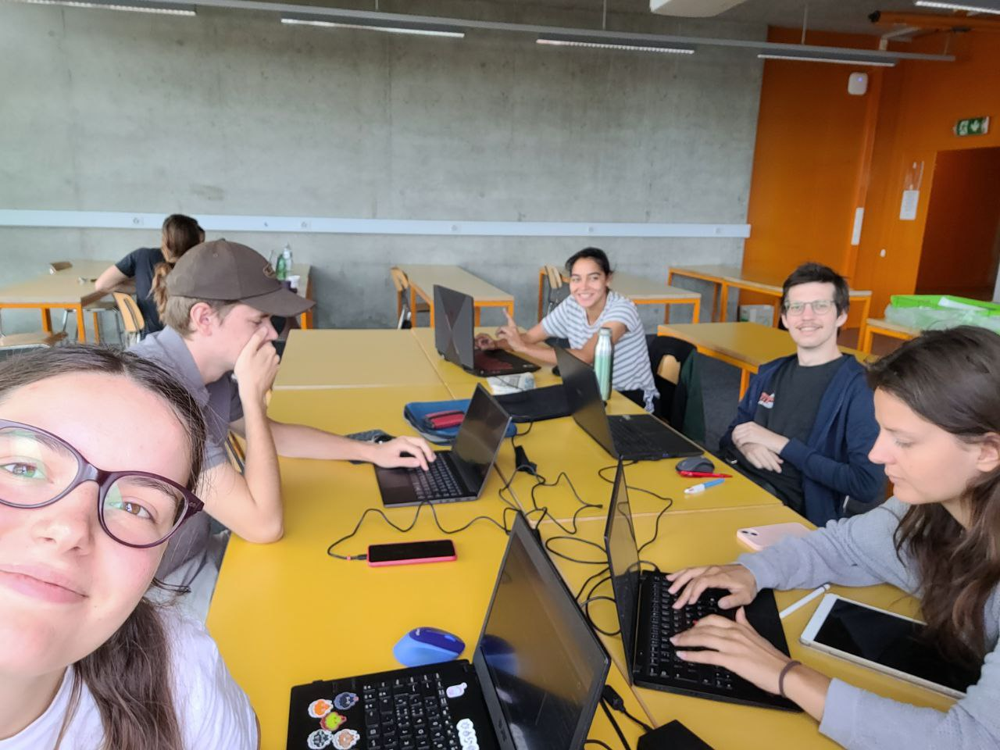

# Landing Page

## Comment tout a commencé
Le jass est un jeu particulièrement populaire et emblématique de la Suisse. S'il est toujours agréable d'y jouer avec des amis ou de la famille, nous avons constaté qu'il n'existe pas vraiment de
solution idéale pour quelqu'un qui veut jouer seul ou affronter des gens en ligne. Nous avons donc choisi de remédier à ces deux problématiques en créant Javass,
une application web qui permet de jouer au chibre contre des bots perfectionnés ou contre des personnes en chair et en os à distance, voire un mélange des deux si l'un des participants est déconnecté en cours de partie.

## Comment ça se joue
Le jass est un jeu de cartes qui se décline en plusieurs variantes. Dans le cadre de ce projet, nous avons choisi de nous concentrer sur la variante considérée comme la plus populaire, à savoir le chibre. Celui-ci se joue en deux équipes de deux joueurs dont l'objectif est d'engranger un maximum de points.
Au début de chaque manche, chaque joueur reçoit neuf cartes. Chacun leur tour, les joueurs posent une carte et le joueur ayant posé la carte la plus haute remporte la plie et commence à jouer pour la plie suivante. Quand tous les joueurs ont posé leurs neuf cartes, la manche s'arrête et les points accumulés par chaque équipe sont comptés et ajoutés à leur total de points. 
Chaque carte possède un certain nombre de point, le but du jeu étant d'atteindre mille points au total avant l'équipe adverse. 

## Comment utiliser le site
Pour pouvoir jouer, il suffit de se rendre sur le site et d'indiquer si l'on souhaite jouer seul ou à plusieurs. Si l'on choisit de jouer seul, un algorithme 
joue automatiquement les trois autres participants. 
Si l'on souhaite jouer à plusieurs, le site crée une session et génère un lien unique transmissible aux personnes avec lesquelles on souhaite jouer afin de leur permettre de rejoindre la partie. Quand les trois autres joueurs ont rejoint la partie, le jeu se lance et si l'un des participants est déconnecté pendant la partie, il est automatiquement remplacé par un bot.

## Comment profiter du site
- les joueurs adverses sont représentés par des animaux super mignons
- le joueur actif peut voir sa main en bas de l'écran et la carte posée par un joueur adverse à chaque tour en face de l'animal représentant le joueur en question
- le décompte des points pour les deux équipes se fait en direct sur un encart situé en haut à gauche de l'écran
- les cartes jouables à chaque tour sont mises en surbrillance, pour poser une carte il suffit de cliquer sur une carte jouable
- si le joueur clique sur une carte qui n'est pas jouable, celle-ci n'est pas posée afin d'éviter toute forme de triche et ainsi offrir une plus-value supplémentaire par rapport au chibre traditionnel
- à la fin de chaque manche, un écran s'affiche et indique le nombre de points marqués par chaque équipe avant d'ajouter ces points à leur total respectif
- à la fin de la partie, un écran s'affiche et indique si le joueur actif a gagné ou perdu ainsi que le score total de chaque équipe

## Comment le site a été construit
Nous sommes une équipe de 5 étudiants en dernière année de bachelor à la HEIG-VD dans la filière Informatique et systèmes de communication. Magali Egger et Tania Nunez sont issues de l'orientation Informatique logicielle, Hugo Huart et Nicolas Wichoud viennent de l'orientation Ingénierie des données tandis que Maëlle Vogel provient de l'orientation Réseaux et systèmes. Cette diversité dans les orientations nous permet de couvrir un champ de compétences relativement large afin d'obtenir le projet le plus complet possible. Nous avons codé cette application dans le cadre d'un projet de HES d'été d'une durée de trois semaines.

*L'équipe du projet, avec de gauche à droite Maëlle Vogel, Hugo Huart, Tania Nunez, Nicolas Wichoud et Magali Egger*
