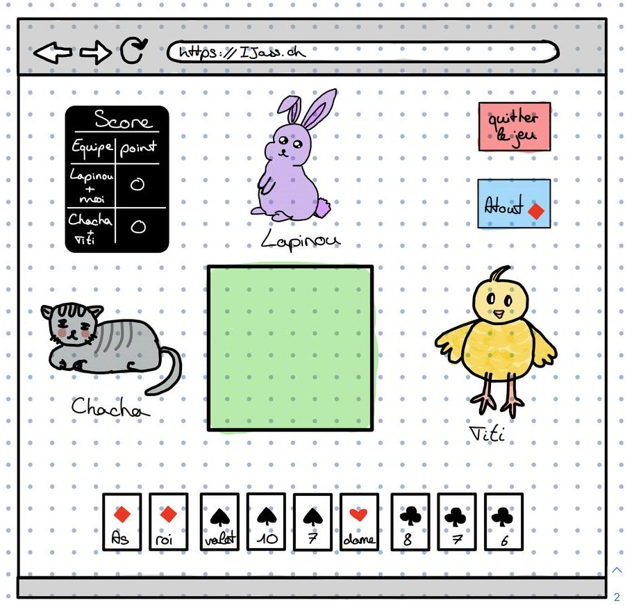
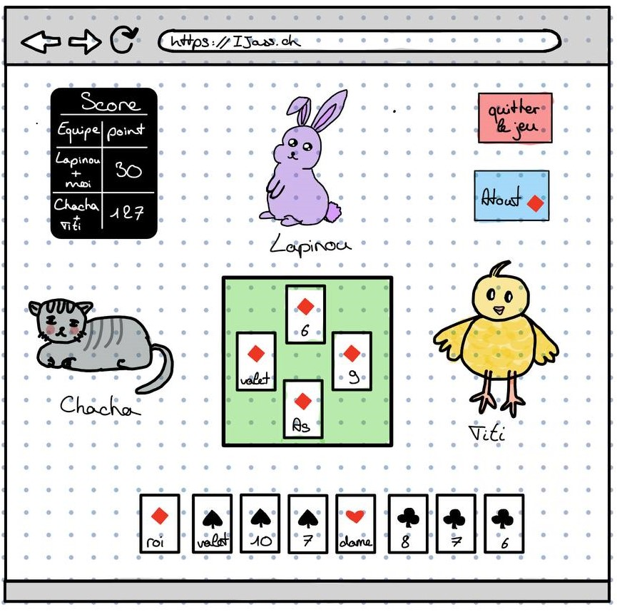
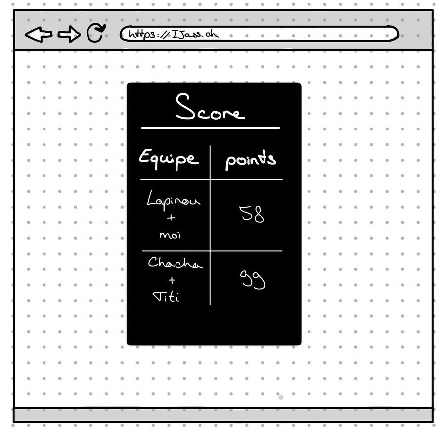
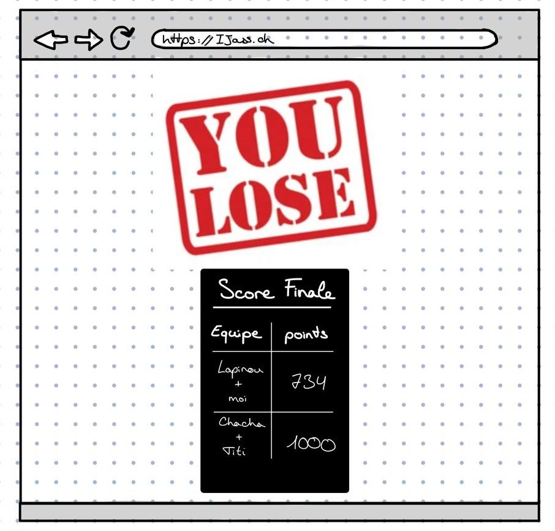

# PDG 2022 - Livrable Semaine 1

Auteurs : Egger Magali, Huart Hugo, Nunez Tania, Vogel Maëlle, Wichoud Nicolas

## Description du projet

Pour ce travail de groupe, nous avons décidé de concevoir un jeu de Jass. L'objectif de ce projet est de pouvoir
jouer au Jass avec un/des joueurs/bots en ligne. Un utilisateur peut jouer une partie en faisant équipe avec un
autre joueur ou un bot.
Cette plateforme de jeu permettra aux utilisateurs de jouer au Jass seul ou avec ses amis tout en comptabilisant
les points au fil des manches et des parties.
Lorsqu'un utilisateur arrive sur la plateforme, il peut choisir de jouer en local (avec et contre des bots) ou
en ligne.
Lorsqu'il joue en ligne, un joueur peut créer une partie ou la rejoindre. Le propriétaire d'une partie peut ajouter
ou retirer des bots comme il le souhaite pour atteindre 4 joueurs.

## Requirements fonctionnels

Notre programme doit permettre de se connecter et jouer une partie à tout moment. Dès lors, nous aurons besoin de
deux entités principales :
- Le client : permettant aux utilisateurs de se connecter à la plateforme et gérant les interactions entre le joueur
  et le jeu.
- Le serveur : permet aux utilisateurs de jouer entre eux ou contre la machine.
  Le serveur est un simple container Docker (l'image choisie est [openjdk:17-alpine](https://hub.docker.com/layers/openjdk/library/openjdk/17-alpine/images/sha256-a996cdcc040704ec6badaf5fecf1e144c096e00231a29188596c784bcf858d05?context=explore)) déployé sur la plateforme Google Cloud
  Run.

Lorsqu'un joueur lance une partie seul, il se voit attribuer un id unique de partie qui sera utilisé dans les requêtes
GET. Dès lors plusieurs parties peuvent avoir lieu en même temps.

Les joueurs jouent par équipe de deux et jouent en alternance.

La Hiérarchie des cartes est la suivante :

Toutes les couleurs sauf l'atout suivent les règles conventionnelles
(As, Roi, Reine, Valet, 10, 9, ..., 6). Concernant l'atout, la carte la plus forte est le valet, que l'on nomme
*buur* suivi par le neuf, appelé *nell*. Les autres cartes suivent les règles conventionnelles entre elles.
L'atout bat toutefois les cartes d'autres couleurs quelles qu'elles soient.

Chaque partie comprend plusieurs rounds, eux-mêmes composés de 9 plie.
Au début de chaque round, chaque joueur se voit distribuer 9 cartes parmi un paquet de 36 cartes. Un des joueurs choisit
la couleur de l'atout. La première fois, c'est celui qui a le 7 de carreau qui choisit l'atout et ensuite cela tourne dans le sens contraire des aiguilles d'une montre.
Une fois la partie commencée, chaque joueur pose une carte par plie. La première carte posée définit la couleur
courante du plie. Un joueur se voit obliger de *jeter* une de ses cartes s'il ne possède pas la couleur
couramment jouée ou de l'atout pour *couper* la plie. À contrario, si un joueur possède une unique carte de la couleur
jouée, il se voit obligé de la jouer, sauf s'il s'agit du buur.

Un plie se termine lorsque chaque joueur a joué ou jeté une carte. Au terme de chaque plie, la personne ayant posé
la carte la plus forte remporte le tas pour son équipe.
Un round se termine lorsque toutes les cartes ont été jouées. Les points sont alors comptabilisés selon les règles
suivantes :
- Buur 20 pts
- Nell 14 pts
- As 11 pts
- Dix 10 pts
- Roi 4 pts
- Reine 3 pts
- Valet 2 pts

Toutes les autres cartes valent 0 pt.
La victoire est remportée par la première équipe atteignant les 1000 pts.

Chaque partie doit se terminer par un arrêt volontaire, une victoire ou une défaite de l'utilisateur.

Un exemple détaillé de l'utilisation du site est présenté dans les mockups situés ci-dessous, indiquant ainsi visuellement les principaux requirements du site du point de vue d'un utilisateur lambda.

### Client

Concernant le client de notre programme, il nous faudra :
- Game Manager : qui interagit avec l'utilisateur et transmet les commandes au jeu
- Modélisation des cartes sous la forme d'une classe
- Assets pour les cartes à jouer
- UI permettant d'afficher la partie en cours

Cette partie sera plus détaillée durant la semaine 2.

## Fonctionnalités espérées

Voici les fonctionnalités minimum qui seront ajoutées au projet durant ces trois semaines.

- Les 36 cartes sont mélangées.
- Les 36 cartes sont distribuées aux 4 joueurs (donc 9 par personne).
- Chaque joueur pose une carte par plie.
- La carte la plus forte emporte la plie.
- Si notre coéquipier ou nous-même gagnons la plie, le score s'incrémente.
- Le score s'incrémente du nombre de points selon ce qui est écrit au-dessus.
- Le joueur choisit l'atout.
- L'atout l'emporte sur les trois autres familles.
- Le buur puis le nell sont les deux plus fortes cartes.
- Le joueur est obligé de suivre la famille qui a été posé en premier.
  - Exception si le joueur n'a pas la famille qui a été posé. Il peut poser n'importe quelle autre carte.
  - Le joueur peut couper avec un atout si une autre famille a été posée.
  - La sous-coupe est interdite. Si quelqu'un coupe on ne peut pas mettre un atout plus faible. Sauf si c'est notre dernière carte.
- Notre coéquipier est toujours lapinou car il est en face de nous.
- Le bot respecte les règles, mais joue une carte aléatoire.

### Si le temps le permet

- Jouer en ligne avec des joueurs.
- Ajouter le chibre (demander à son coéquipier de choisir l'atout pour nous).
- Ajouter les annonces. Au début, on annonce des combinaisons spéciales de cartes pour gagner plus de points.
- Rendre les bots plus intelligent. Qu'ils puissent calculer la probabilité de gagner la plie selon ce qu'ils posent.

## Requirements non-fonctionnels

Le programme doit assurer une partie fluide, en tout cas pendant chaque plie. Ce qui implique que l'interaction
entre l'utilisateur et le serveur doit être de 2 secondes maximum.
L'affichage des points doit être propre et soit affiché en permanence, soit accessible facilement.
Le score doit être mis à jour 2 secondes après la fin de la plie.
Lors de session de jeu multijoueur, la connexion entre eux doit rester stable et si l'un des joueurs se voit
déconnecté, il doit pouvoir rejoindre la partie ou être remplacé par un bot.

## Choix technologiques

### Application

Frontend
- Svelte (Javascript FW)
- Hébergement sur Netlify

Backend
- Java
- Spring
- Docker
- Google Cloud Run

### Déploiement

#### Frontend

Le frontend est déployé sur Netlify, accessible actuellement via l'URL de [déploiement par défaut](https://radiant-cucurucho-67d710.netlify.app/).

Une action GitHub est configurée pour effectuer le déploiement sur Netlify automatiquement (génération de l'application avec npm puis chargement sur Netlify), depuis la branche `main` à l'issue de chaque push sur celle-ci.

#### Backend

Le backend est déployé sur Google Cloud Run, accessible actuellement via l'URL de [déploiement par défaut](https://server-xxcwjwt7qq-ue.a.run.app/).

Comme pour le frontend, une action GitHub est configurée pour effectuer le déploiement sur Google Cloud Run (packaging avec Maven, création et chargement de l'image Docker dans Google Container Registry), lors de chaque modification de la branche `main`.

### Outils utilisés sur le repository github

Nous avons décidé d'utiliser [gitflow](http://danielkummer.github.io/git-flow-cheatsheet/) afin de travailler proprement sur différentes branches avec différents
niveaux de protection.
Nous avons configuré la branche main afin qu'elle ne puisse pas être modifiée par une autre action
qu'un Pull Request. Cette même PR doit être validée par une autre personne.
La branche *develop* est définie comme celle par défaut sur notre repository.
Le workflow gitflow consiste également en la création de la branche *develop* qui est celle sur laquelle
nous allons effectivement travailler. Lorsque nous souhaitons effectuer une release, il suffit de merge
la branche develop au *main*. Chaque fonctionnalité nécessite donc la création d'une nouvelle branche à partir
de *develop* et tout ajout de code se fait exclusivement sur les branches prévues à cet effet. Une fois la feature
terminée, une PR permet de la merge à la branche *develop*.

## Mockups

La page d'accueil de Javass est la suivante :

Lorsque vous appuyez sur "Start a Game", vous êtes menés à une page vous proposant de relire les règles
si vous êtes un profane ou que vous n'avez pas joué depuis longtemps.

Une fois votre relecture des règles terminée, appuyer sur continuer affichera une page permettant de choisir
le type de partie souhaitée. En local veut dire que vous jouez contre des bots.

Avant de commencer à jouer chaque manche, chacun leur tour, les joueurs choisissent la couleur d'atout.

Une fois la partie lancée, les joueurs et votre main sont affichés. Les cartes jouées sont face contre ciel
au centre de l'écran et le score en haut à gauche.

A la fin de chaque plie, le score de l'équipe qui a remporté la plie est automatiquement mis à jour en y ajoutant les points de celle-ci

A la fin de chaque manche, un tableau récapitulatif des scores de la manche est affiché avant de passer à la manche suivante.

À l'issue de la partie les scores sont affichés et les vainqueurs désignés.

## Landing page

*Fichier joint*

## Méthodologie

Afin de mener à bien ce projet, notre équipe a choisi de pratiquer une méthode agile SCRUM. Cette méthodologie
incrémentale correspond à notre dynamique de groupe. Nous allons donc effectuer ce travail sur 3 Sprints correspondant
à chaque semaine.

Chaque début de semaine, nous décomposerons le travail à faire en User stories, elles-mêmes possiblement
décomposées afin d'être partagées entre plusieurs membres du groupe. Chaque membre se voit attitrer (par un autre membre
ou lui-même) une story. Chaque membre doit effectuer trois estimations du temps que prendra la story.
Nous tenons toutefois à appliquer un peu le principe de pair programming si nécessaire.

À la fin d'un sprint, nous repasserons sur les estimations de temps et effectuerons un feedback général afin de
pouvoir améliorer ces aspects au fil des sprints. Si certaines stories ne sont pas achevée à terme du sprint
correspondant, il sera passé au prochain sprint avec la plus haute priorité.

